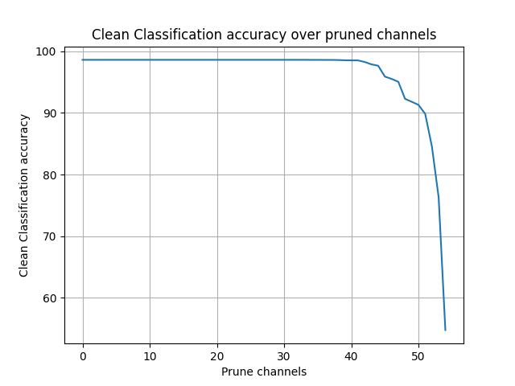

# wz2037_lab3
### Link to [Github](https://github.com/wwZhang0215/wz2037_lab3)
```bash
├── data 
    └── cl
        └── valid.h5 // this is clean validation data used to design the defense
        └── test.h5  // this is clean test data used to evaluate the BadNet
    └── bd
        └── bd_valid.h5 // this is sunglasses poisoned validation data
        └── bd_test.h5  // this is sunglasses poisoned test data
├── models
    └── bd_net.h5
    └── bd_weights.h5
    └── B_pi_net_0.1.h5
    └── B_pi_net_0.04.h5
    └── B_pi_net_0.02.h5
├── architecture.py
├── repair.py
├── Geval.py // custom evaluation script
└── eval.py // this is the evaluation script
```

## I. Dependencies
   1. Python 3.6.9
   2. Keras 2.3.1
   3. Numpy 1.16.3
   4. Matplotlib 2.2.2
   5. H5py 2.9.0
   6. TensorFlow-gpu 2.7.0
   
## II. Data
   1. Download the validation and test datasets from [here](https://drive.google.com/drive/folders/1Rs68uH8Xqa4j6UxG53wzD0uyI8347dSq?usp=sharing) and store them under `data/` directory.
   2. The dataset contains images from YouTube Aligned Face Dataset. We retrieve 1283 individuals and split into validation and test datasets.
   3. bd_valid.h5 and bd_test.h5 contains validation and test images with sunglasses trigger respectively, that activates the backdoor for bd_net.h5. 

## III. Evaluating the Backdoored Model
   1. The DNN architecture used to train the face recognition model is the state-of-the-art DeepID network. 
   2. To evaluate the backdoored model, execute `eval.py` by running:  
      `python3 eval.py <clean validation data directory> <poisoned validation data directory> <model directory>`.
      
      E.g., `python3 eval.py data/cl/valid.h5 data/bd/bd_valid.h5 models/bd_net.h5`. This will output:
      Clean Classification accuracy: 98.64 %
      Attack Success Rate: 100 %

## IV. Important Notes
Please use only clean validation data (valid.h5) to design the pruning defense. And use test data (test.h5 and bd_test.h5) to evaluate the models. 

## V. Repair Network
  1. Repaired network for X={2%, 4%, 10%, 30%} is created by script *`repair.py`*, and output models are stored in *`models/B_pi_net_0.02.h5 models/B_pi_net_0.04.h5 models/B_pi_net_0.1.h5`* 
  2. To evaluate the goodnet *G*, excute *`Geval.py`* by running:
  
     `python3 eval.py <clean validation data directory> <poisoned validation data directory> <B model directory> <B' model dirctory>`.
     
     For each repaired network, corresponding commands are:

     `python3 eval.py data/test.h5 data/bd_test.h5 models/bd_net.h5 models/B_pi_net_0.02.h5`.

     `python3 eval.py data/test.h5 data/bd_test.h5 models/bd_net.h5 models/B_pi_net_0.04.h5`.

     `python3 eval.py data/test.h5 data/bd_test.h5 models/bd_net.h5 models/B_pi_net_0.1.h5`.

     `python3 eval.py data/test.h5 data/bd_test.h5 models/bd_net.h5 models/B_pi_net_0.3.h5`.

  3. Evaluation results are:

      - `B_pi_net_0.02.h5` : `Clean Classification accuracy`: 95.90023382696803
`Attack Success Rate`: 100.0

      - `B_pi_net_0.04.h5` : `Clean Classification accuracy`: 92.29150428682775
`Attack Success Rate`: 99.98441153546376

      - `B_pi_net_0.1.h5` : `Clean Classification accuracy`: 84.54403741231489
`Attack Success Rate`: 77.20966484801247

      - `B_pi_net_0.3.h5` : `Clean Classification accuracy`: 54.762275915822286
`Attack Success Rate`: 6.96024941543258

  4. Plot:
    
     - Clean accuracy: 
     
     

     - Attack success rate:

     

  5. Comment:
  
      Pruning defense does not work for this model. For the defensive part, the attack success rate drop to a very low point. However, the clean classification accuracy also drop significantly. When attack success rate drop to a acceptable rate, the clean classification accuracy is too low to consider the model as a usable model. Therefore pruning defense dose not work for this model.